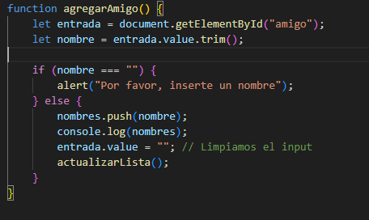
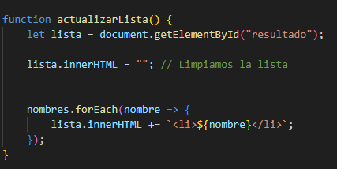
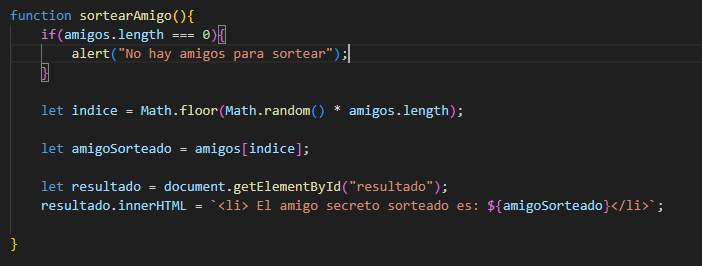
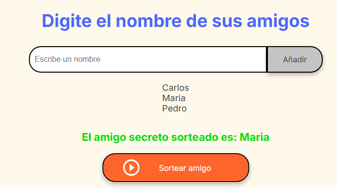

# Amigo Secreto

Este proyecto es una aplicación web para organizar un juego de **Amigo Secreto**. Permite a los usuarios ingresar los nombres de sus amigos y luego sortear un amigo secreto de manera aleatoria. La interfaz es simple, interactiva y fácil de usar.

## Características

- **Agregar amigos**: Los usuarios pueden ingresar los nombres de sus amigos en un campo de texto y añadirlos a la lista.
- **Sorteo aleatorio**: Al hacer clic en el botón "Sortear amigo", la aplicación selecciona aleatoriamente uno de los amigos ingresados.
- **Interfaz sencilla**: La aplicación tiene una interfaz limpia y fácil de usar.

## Tecnologías

- **HTML5**: Estructura básica de la página.
- **CSS3**: Estilos para la interfaz de usuario.
- **JavaScript**: Lógica de la aplicación, incluyendo la funcionalidad para agregar amigos y realizar el sorteo.

## Funcionalidades de JavaScript

### `agregarAmigo()`
Esta función permite agregar un nombre a la lista de amigos. Si el campo de texto está vacío, muestra un mensaje de alerta pidiendo al usuario que ingrese un nombre. De lo contrario, el nombre se añade al array `amigos` y se actualiza la lista en el DOM.



### `actualizarLista()`
Esta función actualiza la lista de amigos en la página. Limpia el contenido actual del elemento con id `listaAmigos` y agrega cada nombre del array `amigos` como un elemento `<li>`.



### `sortearAmigo()`
Esta función realiza el sorteo de un amigo secreto. Primero, valida si hay amigos en la lista (si el array `amigos` no está vacío). Luego, selecciona aleatoriamente un índice usando `Math.random()` y `Math.floor()`, y muestra el nombre del amigo sorteado en el elemento con id `resultado`.



## Instrucciones de uso



1. **Agregar un amigo**: Escribe el nombre de un amigo en el campo de texto y haz clic en "Añadir". El nombre se añadirá a la lista de amigos.
2. **Sortear un amigo**: Después de agregar los amigos, haz clic en "Sortear amigo". La aplicación seleccionará aleatoriamente un amigo secreto de la lista y lo mostrará en la pantalla.

## Instalación

1. Clona este repositorio en tu máquina local:
    ```bash
    git clone https://github.com/tuusuario/amigo-secreto.git
    ```

2. Abre el archivo `index.html` en tu navegador favorito para ver la aplicación en acción.

## Estructura del Proyecto

```plaintext
amigo-secreto/
│
├── index.html         # Página principal
├── style.css          # Estilos de la aplicación
├── app.js             # Lógica de la aplicación
├── assets/            # Carpeta para imágenes y otros recursos
│   └── amigo-secreto.png
│   └── play_circle_outline.png
└── README.md          # Documentación del proyecto
```

